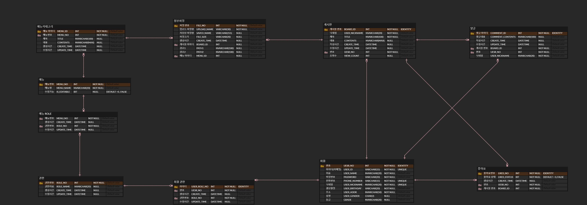

# Global-Warming-Board
지구온난화 정보를 공유하고 토론하는 커뮤니티 

## 프로젝트 개요

- **개발자 :** 1명

- **개발 기간:** 2024-10-28 ~ 2025-01-31

- **사용자 대상:** 지구온난화에 관심 있는 유저

- **주요 기능:**
  - 자유게시판: CRUD, 검색, 좋아요, 조회수
  - 회원 시스템: 회원가입, 로그인, 마이페이지, 회원 정보 수정/탈퇴
  - 댓글 기능: CRUD
  - 기후변화 데이터 제공(그래프,뉴스 등)

## 기술 스택
- **Backend:** Java 21, Spring Boot 3.3.3, Spring Data JPA
- **Frontend:** Mustache, Bootstrap
- **Database:** MSSQL
- **Build Tool:** Gradle 8.10.1
- **Version Control:** GitHub

## 프로젝트 실행 방법
> ⚠ **중요:** 이 프로젝트는 반드시 `C:\` 경로에 클론(복제)해야 합니다.
>  첨부파일의 경로 문제로 인해 다른위치에서 실행하면 정상적으로 보이지 않을 수 있습니다.

### **방법 1: Git 명령어 사용(권장)**

```터미널 창 git bash
# 1. C 드라이브로 이동
cd C:\

# 2. 프로젝트 클론(복제)
git clone https://github.com/DG0702/project.git

# 3. 프로젝트 폴더로 이동
cd project

# 4. Gradle 빌드
./gradlew build

# 5. 애플리케이션 실행
./gradlew bootRun
```

### **방법 2 : Intellij에서 GitHub 저장소 가져오기 (GUI 사용)**
```
1. Intellij 실행 
2. Welcome to IntelliJ IDEA 화면에서 "Get from VCS" 클릭
3. Version Control 옵션에서 Git 선택
4. URL 입력: https://github.com/DG0702/project.git
5. Directory를 C:\project로 설정 (⚠ 반드시 C:\ 경로 지정)
6. Clone 버튼 클릭
7. 터미널 창에서 git bash에서 git pull origin main --allow-unrelated-histories
8. 캐시 초기화 File -> Invalidate Caches / Restart 실행
9. 프로젝트 실행
```

📌 주요 기능

🔹 회원 기능
- 회원가입 (이메일, 닉네임, 전화번호 중복 검사)
- 로그인 및 로그아웃
- 마이페이지 (회원 정보 수정, 탈퇴, 내가 쓴 게시글/댓글 관리)

🔹 게시판 기능
- 게시물 작성, 수정, 삭제
- 좋아요, 조회수 반영
- 최신 게시물 10개 표시 

🔹 기후변화 정보

- 온난화 관련 뉴스 및 데이터 제공
- 기후 변화 그래프 시각화


## 📂 데이터베이스 설계
- 아래는 프로젝트의 ERD(Entity-Relationship Diagram )입니다.
- ERD를 통해 테이블 간 관계를 쉽게 이해할 수 있습니다.


## 📊 테이블 설계서
테이블 설계서는 [여기](./docs/database-design.docx)에서 확인하실 수 있습니다.

## 📢 API 명세서
API 명세서는 [여기](./docs/api-design.docx)에서 확인하실 수 있습니다.

## 🎨 화면 설계서
화면 설계서는 [여기](./docs/ui-design.docx)에서 확인하실 수 있습니다.


## 🤝 기여 방법
- Pull Request 작성 후 코드 리뷰 요청